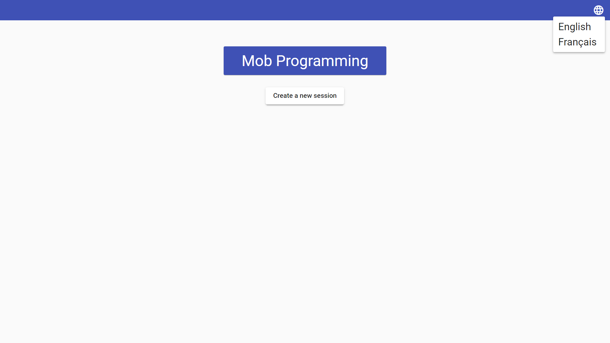
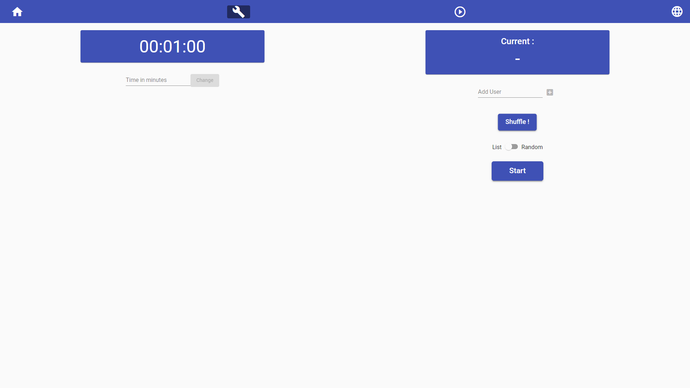
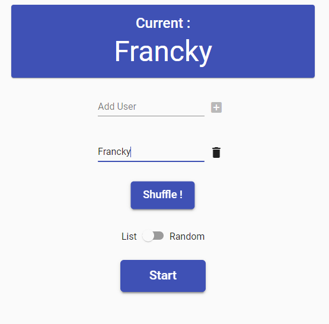

#Mob programming

## Purpose

This mob-programming application was created by 4 students in the 2nd year of software engineering within the AEN group, more precisely on the Nîmes campus.

PACK Solutions uses the agile methodology within its company. This is why PACK Solutions asks these 4 students to create a mob programming application in order to be able to hold meetings with this tool remotely.

[<p align="center" float="left"> ](https://www.groupe-aen.info/)
[](http://www.pack-solutions.com/)
## Installation

### Platform & tools

You need to install Node.js and then the development tools. Node.js comes with a package manager called [npm](http://npmjs.org) for installing NodeJS applications and libraries.
* [Install node.js](http://nodejs.org/download/) (requires node.js version >= 12.14.0)

### Clone the repo

```shell
git clone https://github.com/PACK-Solutions/mob-programming
cd mob-programming
```

### Install npm packages

Install the `npm` packages described in the `package.json` and verify that it works:

```shell
npm install
```

### Launch the application

How to run the application after install :

```shell
cd [PROJECT NAME]
ng serve
```

### How to use the application
The "home" page is divided into 4 parts:

### Top of page 

In this part, we find the different buttons to access the different pages:
   
   ● Reception,
   ● Parameters,
   ● Launch mobprogramming,

   Also at the top right, a button to change the language of the website to three different languages:
   
● French,
● English

### Timer part

In this part, we find the timer used to organize the mob programming sessions. By default it is set to 1 hour, you can change it at any time.

From this part, you can modify the timer using an input block allowing you to enter the time in minutes. Once you have entered the necessary modifications, click on the “Change” button to validate your modifications.

### Employees part introduction
  In this part, you will configure the list of developers and collaborators, you can also change the rotation method. This part will interact directly with the timer at the end of each cycle.

### Collaborator list part
  From this part, you can find a list comprising all the collaborators by their names, you can remove collaborators using the delete button (trash can icon) and modify them by clicking directly on their names, editing is done in real time.

here is an example :


### Employee addition part

Above the list of collaborators, you have a text block allowing you to add one or more collaborators, they will be added to the list below.

### Operating cycle parameter setting part

From this part, you can change the sponsorship playback method and change the list display when the timer is counting down.
You can shuffle the list of collaborators using the “Shuffle!” Button. who will modify the list.
You can also change the course of the cycles and therefore the reading of the sponsors by activating the “Random” mode instead of “List”.
Nb: Activate the random mode, will hide the list of collaborators when the timer starts.


### In the run page, the essential information is condensed there.

We can see :
- The Timer
- A play and stop button
- A button to go to the next employee
  In List mode:
- The current employee
-	The following
   In Random mode:
- Only the current employee

## Browser compatibility
| Browser | Tested versions |
| ------- | ------------------ |
| `Firefox` | ≥ `v89.0` |
| `Chrome` | ≥ `v91.0.4472.101` |
| `Microsoft Edge` | ≥ `91.0.864.41` |
| `Brave` | ≥ `1.23.73` |
