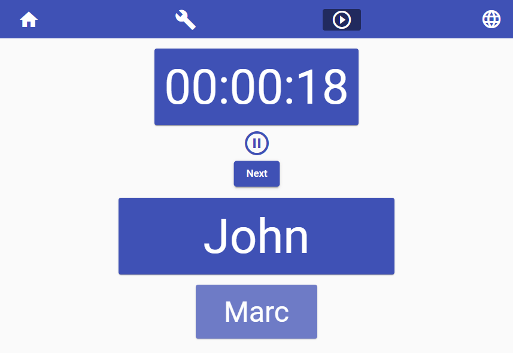

# Mob Programming


## Overview
Mob Programming is a software development approach where the whole team works on the same thing, at the same time, in the same space, and at the same computer. For more details, see the Agile Alliance definition : https://www.agilealliance.org/glossary/mob-programming.

With global pandemic context and remote workers, it has become really hard to bring the team at the same place. This is where this app comes in, by dematerializing this approach.
> For a better experience with remote collaborators, you should use your favorite communication tool together with this app.

For the record, this application was initially created by a group of 2nd year undergraduate students in software engineering from the AEN Group (Nîmes campus), sponsored by PACK Solutions.

[](https://www.groupe-aen.info)
[](http://www.pack-solutions.com)

## Installation

### Platform & tools
You need to install Node.js and then the development tools. Node.js comes with a package manager called [npm](https://www.npmjs.com) for installing Node.js applications and libraries.
* [Install node.js](https://nodejs.org/download/) (requires Node.js version ≥ `12`)

### Clone the repo
```shell
git clone https://github.com/PACK-Solutions/mob-programming
cd mob-programming
```

### Install npm packages
Install the `npm` packages described in the `package.json` and verify that it works:

```shell
npm install
```

### Run the application
How to run the application after install :

```shell
ng serve
```

## How to
Once the app is running, open your web browser (see [Browser compatibility](#browser-compatibility)) and go to http://localhost:4200
> If port 4200 is already in use, you can run the app on a another port (look at the `--port` option on https://angular.io/cli/serve)

Now you should see the "Rooms" page with two options:
* Create a new session
* Change language (in English by default)


### Settings


After clicking on *Create a new session*, you have to configure:
* Time session by team member in minutes (left block).
* Add all the members of your team (right block).
* Optionally, you can:
  * Shuffle team members.
  * Rename or remove team members.
  * Use random mix of team members (by default each turn is in ordered mode by list).

You're ready? So click `Start`.

### Mob Programming is started!


The top name is the team member who is developing, the bottom name is the next turn when the chrono arrives at 0 and the sound notification sounds.
> Bottom name is only present on `List` mode.

> Tips:
> - When the team needs a break, you can click the pause button.
> - If the team member whose turn is ongoing must be absent, you can click the `next` button.

Enjoy!

## Browser compatibility
| Browser | Tested versions |
| ------- | ------------------ |
| `Brave` | ≥ `1.23.73` |
| `Chrome` | ≥ `91` |
| `Firefox` | ≥ `89` |
| `Microsoft Edge` | ≥ `91` |

## Mentions
Thanks to [inipagi](https://www.iconfinder.com/inipagi) on Iconfinder who made the logo we use for the Mob Programming app.
